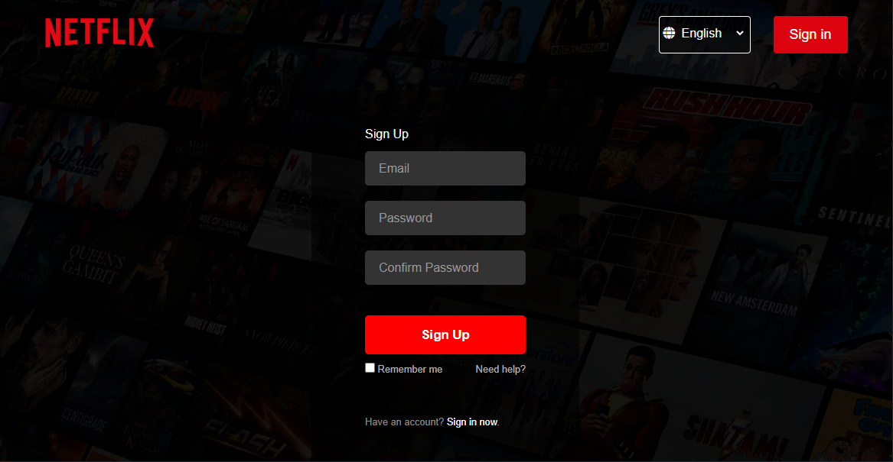
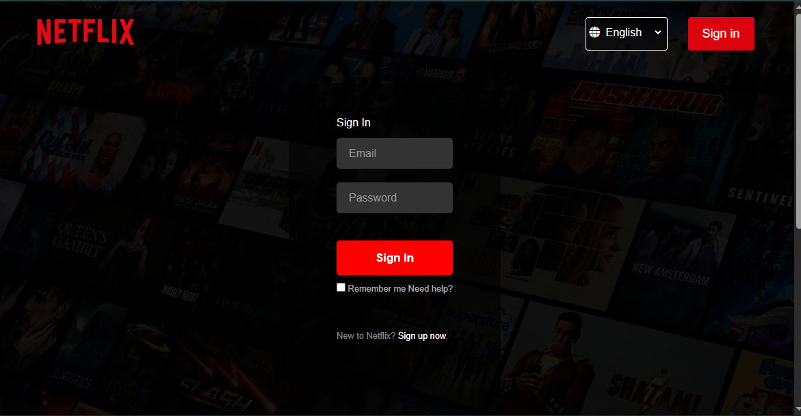
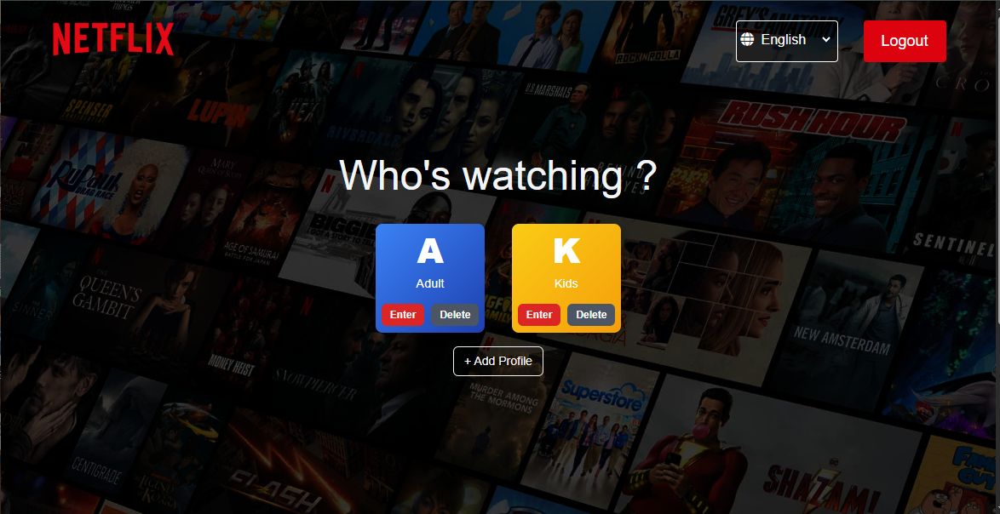
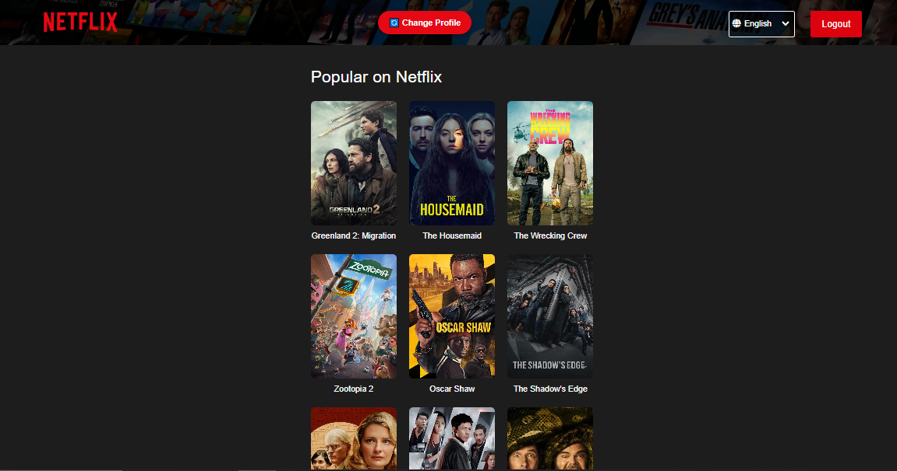
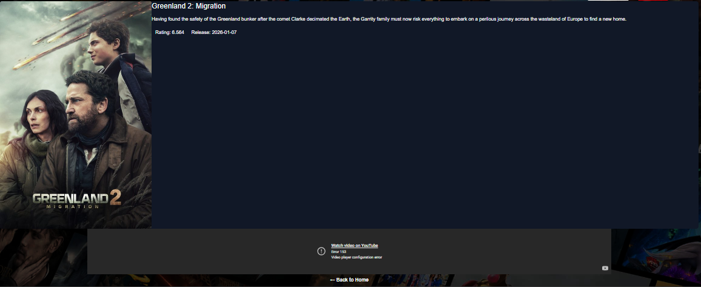
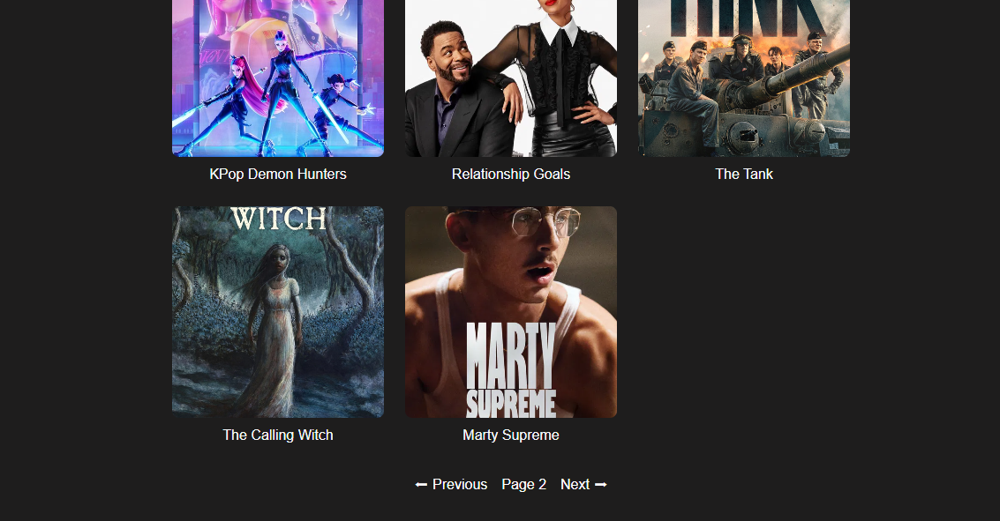

# 🎬 Netflix Clone (Django)

A Netflix-inspired video streaming web application built using **Django, SQLite, HTML, CSS, and JavaScript**.  
The project includes **user authentication, multiple profile management, and dynamic movie browsing** with a responsive dark-themed UI.

---

## 🚀 Features

- 🔐 User authentication (Login / Signup / Logout) using **Django Allauth**
- 👤 Multiple **profiles per user** (Kids & Adult support)
- 🎥 Movie listing and **movie detail page**
- 📄 **Pagination for movie lists** to efficiently browse large collections
- 🖼 Dynamic posters, overview, and trailer integration
- ▶ Embedded **YouTube trailer playback**
- 🌙 Netflix-style **dark responsive UI**
- 🧭 Secure routing using **profile UUID**
- 🗄 SQLite database integration
- 🔌 Ready for **TMDB API integration**

---

## 🛠 Tech Stack

**Backend**
- Django
- SQLite

**Frontend**
- HTML
- CSS
- JavaScript

**Libraries**
- django-allauth
- requests
- python-dotenv
- pillow

---

## ⚙️ Installation & Setup
### 1️⃣ Clone the repository
```bash
git clone https://github.com/14nishantkumar/Video-Streaming-platform-based-on-Netflix-UI.git
cd netflix-clone-django
```

### 2️⃣ Create virtual environment
```bash
python -m venv myworld
```
### 3️⃣ Activate virtual environment
**Windows**
```bash
myworld\Scripts\activate
```
**Mac/Linux**
``` bash
source myworld/bin/activate
```
### 4️⃣ Install dependencies
```bash
pip install -r requirements.txt
```
### 5️⃣ Run migrations
```bash
python manage.py makemigrations
python manage.py migrate
```
### 6️⃣ Start development server
```bash
python manage.py runserver
```
**⚠️ To run this project, you must generate your own TMDB API key and add it to the project .env file before starting the server.**
### Open in browser:
```bash
http://127.0.0.1:8000
```
---
## 📸 Screenshots

### Signup Page


### Login Page


### Profile Selection


### Movie List


### Movie Detail Page


### Movie List with Pagination


---
## 📈 Future Improvements

- ▶ Video streaming player

- ❤️ Watchlist feature

- ⏳ Continue watching section

- 🌐 Full TMDB API auto-sync

- ☁ Deployment (Render / AWS)
